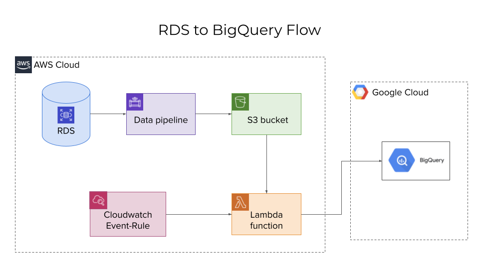

## Deployment
This document covers transferring your data from an Amazon's RDS Postgres database to a Google's BigQuery dataset. The overall process involves various steps and setting up different services at Amazon and Google.

## Pre-requisites
The setup and deploy process involves an understanding of various tools:
1. AWS RDS
2. AWS DataPipeline
3. AWS Lambda
4. AWS S3
5. AWS Cloudwatch event/rules
6. Google BigQuery

### High level architecture
Here's a high level flow diagram of how data is transferred from RDS to BigQuery. Use the diagram below to further understand the points visually.
1. RDS stores the active data records.
2. AWS Data pipeline works as an ETL layer to "extract, transform and load" data into CSV formats and then put it in an S3 bucket. The ETL process runs on an EC2 instance that is managed within the data pipeline configurations.
3. A lambda function reads the CSV files from S3 and then uses a Google Cloud Python API client to push data into BigQuery.
4. The lambda function is invoked on an hourly basis using Cloudwatch event-rule.



## Deployment steps

### Set up S3 bucket
1. Visit the S3 dashboard.
2. Create a bucket where you want the CSV files to be stored. These files will contain the data from your RDS database.
3. Create another bucket where you want to keep the logs of the data pipeline.

### Set up Data Pipeline
1. Make a copy of the `data-pipeline-template.json` file. It is at the root folder of this project.
   1. Update the values at the bottom of the file for the RDS and S3.
   2. Make sure to update the value of `pipelineLogUri` that's defined somewhere inside the JSON. This should contain the URI for the S3 bucket where you want to store Data Pipeline Logs.
   3. Read about all these values in our [Data Pipeline guide](DATA-PIPELINE.md).
2. Visit the data pipeline dashboard from your AWS console.
3. Click on `Create new` data pipeline.
4. Enter name and description for your data pipeline.
5. In the source option, use `Import a definition` and then `Load local file`. Upload the copy of your data pipeline JSON file you edited in previous step.
6. Once uploaded, you see all the configured values in JSON are also loaded. In case you still to edit any field, you can do that.
7. Finally, go to the bottom of the form and click on `Activate` button.
8. You will see the list updated in your AWS data pipeline dashboard. Click on the pipeline id to see various components running inside.
9. Once all components reach `FINISHED` state, navigate to the S3 folder for CSV outputs. You will see several CSV files that include the data from RDS.

### Create BigQuery project
1. Visit the [BigQuery dashboard](https://console.cloud.google.com/bigquery) in your Google Cloud Platform account.
2. You can either select an existing project or create a new one within your GCP account.
3. In the BigQuery dashboard, you will see the project in the sidebar. There won't be any datasets yet.
4. You don't need to create any datasets. They will be automagically created by the Lambda function below. :wink:
5. Next, create a service account for your GCP account. Grant the BigQuery admin permission to the service account.
6. Download the service account credentials file and rename it to `gcp-service-account.json`.
7. Copy the GCP service account credentials file to the project folder.
### Set up Lambda
1. Go to your AWS dashboard and from services, select `Lambda`.
2. Click on `Create function` button.
3. Enter the name of your function. Can be like `plio_s3_to_bigquery_public_schema`.
4. Select `Python 3.8` in the Runtime option.
5. Click on `Create function` button at the bottom. You will see the function in your lambda function list.
6. Next run the following commands to create a zip file that includes the python dependencies, lambda function and the GCP service account credentials:
```sh
mkdir -p package/
cd package/ &&  zip -r ../plio-rds-to-bigquery.zip .
cd .. && zip -g plio-rds-to-bigquery.zip lambda_function.py gcp-service-account.json
```
7. It will create a zip file with name `plio-rds-to-bigquery.zip` in your folder.
8. Navigate to the `Code source` section. Click on `Upload from` dropdown and select `.zip file` option.
9. Upload the zip file. It may take some time to upload.
10. Once uploaded, switch to the `Configuration` tab and go to `Environment variables` section.
11. Add the following environment variables. More details about these variables can be found at [ENV guide](ENV.md).
    1.  BIGQUERY_DATASET_ID
    2.  BIGQUERY_PROJECT_ID
    3.  BIGQUERY_REGION
    4.  DB_HOST
    5.  DB_NAME
    6.  DB_USER
    7.  DB_PASSWORD
    8.  DB_PORT
    9.  DB_SCHEMA_NAME
    10. GOOGLE_APPLICATION_CREDENTIALS
    11. S3_BUCKET_NAME
    12. S3_DIRECTORY
12. Go the the `General Settings` tab and increase the timeout value to 5 minutes. This is because the lambda function will take some time to push all the data to BigQuery.
13. Try testing the lambda function by switching to the `Test` tab and clicking on the `Test` button. If everything goes well, you should see a green box with 200 statusCode.

### Set up Cloudwatch Rule to trigger lambda
1.  Go to `Cloudwatch` dashboard and navigate to `Events > Rules` tab.
2.  Click on "Create rule" button.
3.  Enter the name of the rule. An example can be `plio_lambda_run_every_hour`
4.  Enter description for your rule.
5.  Under `Define Pattern` section, click on `Schedule` option.
6.  Select `Fixed rate every`. Set the value to `1` and `Hours` in the unit dropdown.
7.  Go to select targets section and select `Lambda function` from the available options.
8.  Select your lambda function in the next dropdown.
9.  Create the rule.
10. The lambda is now automated to run every hour.
